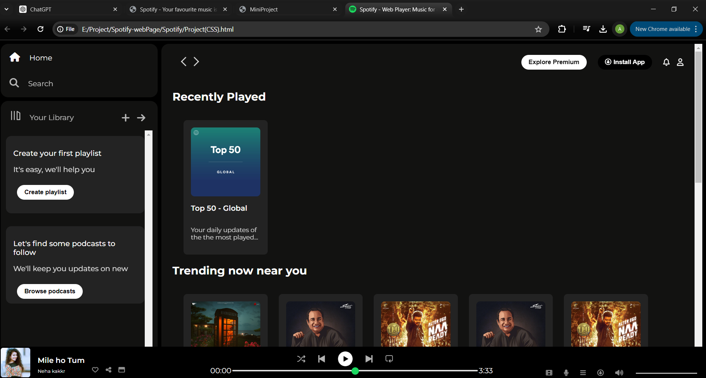
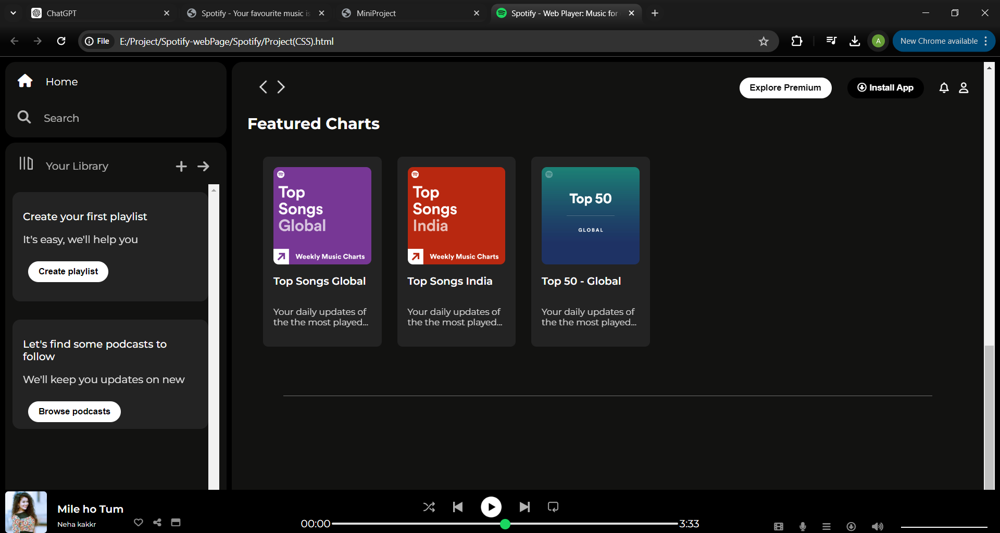

# Spotify Home page

1. This is a Spotify home clone that uses some images and icons. It has a sticky header and footer and is built with HTML and CSS.

2. To create this, you can use a slider, header, and footer. These elements are made using different divs, where images and content are added.

  

3. In this clone, the header, footer, and sidebar are sticky, while only the central part scrolls up and down. Icons are styled and fixed in size.

4. In this clone, different divs have been used, and styles have been set for all these divs.

 

5. Some images and icons have been added to this clone. HTML and CSS were used to create it.
